# IEEE PointSys Backend

A RESTful API backend for managing member points and admin access of the IEEE Student Branch.
Built with Node.js, Express, and PostgreSQL, the backend supports user and admin management, score updates, and token-based authentication.

---

## Project Overview

This backend provides APIs to:
- Register new users and admins
- Update or modify users’ points
- Fetch ranked leaderboard
- Handle admin authentication via JWT tokens

It is designed to work together with the IEEE frontend hosted at
- https://ieee.eecs.umich.edu

Backend API is currently deployed at:
- https://en-pt5n.onrender.com

---

## Structure Overview

```mermaid
flowchart LR
    %% Define Sections
    subgraph FRONTEND["Frontend"]
        A1[Member Leaderboard Page]
        A2[Admin Dashboard]
    end

    subgraph BACKEND["Backend API"]
        B1["GET /pointSys<br/>Fetch leaderboard"]
        B2["POST /updatePoints<br/>Update user score / add member"]
        B3["POST /credentials<br/>Admin login (JWT cookie)"]
        B4["GET /verifyToken<br/>Verify login status"]
    end

    subgraph DATABASE["PostgreSQL Database"]
        D1["users<br/>── unique_name<br/>── name<br/>── point"]
        D2["admins<br/>── username<br/>── name<br/>── password"]
    end

    %% Connections
    A1 -->|Fetch scores| B1
    A2 -->|Login| B3
    A2 -->|Update points| B2
    A2 -->|Verify token| B4

    B1 --> D1
    B2 --> D1
    B2 --> D2
    B3 --> D2
    B4 --> D2

    %% Styling
    classDef frontend fill:#E3F2FD,stroke:#2196F3,color:#0D47A1,stroke-width:2px
    classDef backend fill:#E8F5E9,stroke:#4CAF50,color:#1B5E20,stroke-width:2px
    classDef database fill:#FFF3E0,stroke:#FB8C00,color:#E65100,stroke-width:2px

    class FRONTEND frontend
    class BACKEND backend
    class DATABASE database
```



--- 

## Tech Stack

| Layer          | Technology               |
|----------------|--------------------------|
| Runtime        | Node.js (Express)       |
| Database       | PostgreSQL (pg library) |
| Auth           | JWT (jsonwebtoken)      |
| Security       | bcrypt password hashing |
| Environment Config | Custom config file: config/config.js |


---


# Configuration

All environment variables and constants are managed via:

```javaScript
// config/config.js
module.exports = {
  DB_CONFIG: {
    user: "postgres",
    host: "localhost",
    database: "ieee_points",
    password: "your_password",
    port: 5432,
  },
  FRONTEND_URL: "https://ieee.eecs.umich.edu",
  RELEASE_MODE: true,
  SECRET_KEY: "super_secret_key",
};
```

---

## Database Schema

The backend expects two tables in PostgreSQL:

```sql

CREATE TABLE users (
  id SERIAL PRIMARY KEY,
  unique_name TEXT UNIQUE NOT NULL,
  name TEXT NOT NULL,
  point INTEGER DEFAULT 0
);

CREATE TABLE admins (
  id SERIAL PRIMARY KEY,
  username TEXT UNIQUE NOT NULL,
  name TEXT NOT NULL,
  password TEXT
);
```

---

## API Documentation

🔹 GET /pointSys

Fetches all users ranked by points.

Response Example:

```json
[
  { "unique_name": "alice", "name": "Alice Zhang", "point": 120 },
  { "unique_name": "bob", "name": "Bob Li", "point": 80 }
]
```

---

## POST /updatePoints

```json
{
  "unique_name": "alice",
  "scale": 5,
  "isnewadmin": false,
  "isnewmember": false,
  "password": "",
  "name": "Alice Zhang"
}
```

Add or subtract points from a user.
Optionally create new users or admins during the same call.

Request Body:

```json
{
  "unique_name": "alice",
  "scale": 5,
  "isnewadmin": false,
  "isnewmember": false,
  "password": "",
  "name": "Alice Zhang"
}
``` 


Response Example:

```json
{
  "success": true,
  "message": "Points updated successfully",
  "newPoints": 125
}
```

If the user doesn’t exist and isnewmember: true, a new member is automatically created.

---

## POST /credentials

Verify admin login and return a JWT cookie for authentication.

Request Body:

```json
{
  "withpassword": true,
  "username": "admin01",
  "password": "mySecret123"
}
```

Response:

```json
{ "success": true }
```
POST /credentials
```json
{
  "withpassword": true,
  "username": "admin01",
  "password": "mySecret123"
}
```
Response:

```json
{ "success": true }
```

If credentials are valid, the response will include an HTTP-only cookie token valid for 2 hours.

---

## GET /verifyToken

Check if the admin is logged in and if their JWT is still valid.

Response (Valid Token):

```json
{
  "success": true,
  "decoded": {
    "username": "admin01",
    "isAdmin": true,
    "name": "John Doe",
    "RELEASE_MODE": true,
    "iat": 1729451133,
    "exp": 1729458333
  },
  "loggedIn": true
}
```

Response (Invalid Token):

```json
{
  "success": false,
  "message": "Invalid token"
}
```

---

## Core Functions Explained

- `insertNew(tableName, unique_name, password, name)`

Creates a new user or admin, automatically hashing admin passwords with bcrypt.

- `updatePoints(unique_name, scale)`

Adjusts a member’s score while preventing it from dropping below zero.

- `processUpdatePoints(...)`

Wrapper that allows simultaneous user creation and score update.

- `signToken(payload)`

Generates a 2-hour JWT token for secure session-based admin login.

---

## Example Flow

1. Admin Login → /credentials → receive token cookie
2. Frontend Calls /updatePoints when scores are updated
3. Frontend Periodically Fetches /pointSys to refresh leaderboard
4. Frontend Calls /verifyToken on load to check if still logged in

---

## Development

To run the backend locally:

```bash
git clone https://github.com/gaoshenghan1130/ieee-backend
cd ieee-backend
npm install
npm run dev
```
Server runs by default on http://localhost:5000

---

## Deployment

The backend can be deployed easily on Render or any Node.js host.
Make sure environment variables are properly set:

- DB_USER, DB_HOST, DB_DATABASE, DB_PASSWORD, DB_PORT, SECRET_KEY

Frontend URL must be whitelisted in CORS or cookie settings:

```javascript
res.cookie('token', token, {
  httpOnly: true,
  secure: true,
  sameSite: 'None'
});
```
---
## Contact

Author: Gao Shenghan

Email: shenghan@umich.edu

For database access or additional API endpoints, please contact directly.
